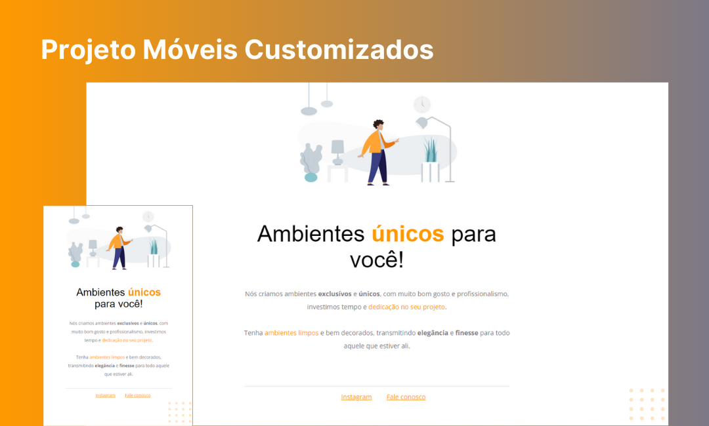

<h1 align="center"> Móveis Customizados </h1>

Projeto criado a partir do desafio Projeto 01 do curso Explorer da Rocketseat.

  <a href="#-tecnologias">Tecnologias</a>&nbsp;&nbsp;&nbsp;|&nbsp;&nbsp;&nbsp;
  <a href="#-projeto">Projeto</a>&nbsp;&nbsp;&nbsp;|&nbsp;&nbsp;&nbsp;
  <a href="#memo-licença">Licença</a>

  

  

## 🚀 Tecnologias

Esse projeto foi desenvolvido com as seguintes tecnologias:

- HTML e CSS
- Git e Github
- Figma

## 💻 Projeto

Este projeto é layout de um website simples que oferece serviços de decoração de interiores.

[Visite o projeto online](https://emyrsilva.github.io/projetoMoveisCustomizados/)

## :memo: Licença

Esse projeto está sob a licença MIT.

---

Feito por [Emily Silva](https://github.com/emyrsilva) com apoio da [Rocketseat](https://www.rocketseat.com.br/) 💛
